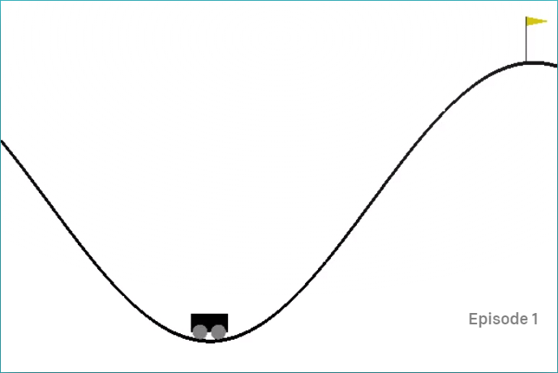

# Reinforcement learning for mountain car

## Problem Description
Consider the task of driving an underpowered car up a steep mountain road. 

The difficulty is that gravity is stronger than the car's engine, and even at full throttle, the car cannot accelerate up the steep slope. The only solution is to first move away from teh goal and end up the opposite slope on the left. Then, by applying full throttle the car can build up enough inertia to carry it up the steep slope even though it is slowing down the whole way. This is a simple example of a continuous control task where things have to get worse in a sense (farther away from goal) before they can get better. MAny control methodologies have great difficulties with tasks of this kind unless explicitly aided by a human controller. 

## Solution
We will use Reinforcement learning - Q learning to calculate an optimal policy for the car to reach the top of the hill.

## Usage
We will use the Gym OpenAI's environement for this problem. One simple way to install it is with pip (pip install gym).

## Results

## Further Study

## Reference
The mountain car problem description is taken from "An introduction to reinforcement learning" by Sutton and Barto. (https://webdocs.cs.ualberta.ca/~sutton/book/the-book.html)
